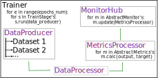

Getting started guide
=====================

First of all look at main classes of Neural Pipeline:

* `Trainer <https://neural-pipeline.readthedocs.io/en/master/api/train.html#neural_pipeline.train.Trainer>`_ - class, that implements training process
* `TrainConfig <https://neural-pipeline.readthedocs.io/en/master/api/train_config.html#neural_pipeline.train_config.train_config.TrainConfig>`_ - class, that store hyperparameters
* `AbstractTrainStage <https://neural-pipeline.readthedocs.io/en/master/api/train_config.html#neural_pipeline.train_config.train_config.AbstractStage>`_ - base class for single stage of training process. Don't worry, Neural Pipeline have predefined classes for common use cases: `TrainStage <https://neural-pipeline.readthedocs.io/en/master/api/train_config.html#neural_pipeline.train_config.train_config.TrainStage>`_, `ValidationStage <https://neural-pipeline.readthedocs.io/en/master/api/train_config.html#neural_pipeline.train_config.train_config.ValidationStage>`_ and more common - `StandardStage <https://neural-pipeline.readthedocs.io/en/master/api/train_config.html#neural_pipeline.train_config.train_config.StandardStage>`_
* `DataProducer <https://neural-pipeline.readthedocs.io/en/master/api/data_producer.html#neural_pipeline.data_producer.data_producer.DataProducer>`_ - class, that unite datasets and unite it's interface
* `FileStructManager <https://neural-pipeline.readthedocs.io/en/master/api/utils.html#neural_pipeline.utils.file_structure_manager.FileStructManager>`_ - class, that manage file structure

Training stages needed for customize training process. With it `Trainer` work by this scheme (dataflow scheme for single epoch):

.. toctree::
   :maxdepth: 4
   :caption: Now step by step create training process:

   dataset
   train_config
   trainer
   training
   continue

After this tutorial look to `segmentation example <https://github.com/toodef/neural-pipeline/blob/master/examples/notebooks/img_segmentation.ipynb>`_ for explore how to work with specific metrics.