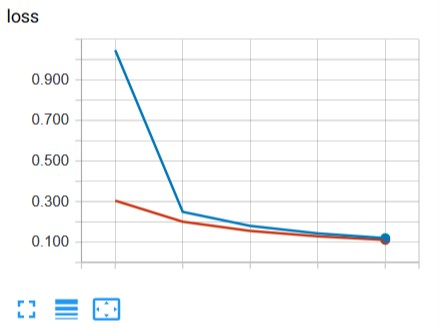
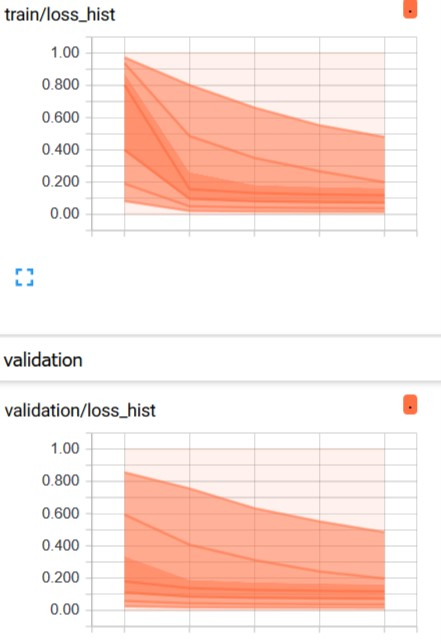

Start training
==============

Now we can just start training process:

.. code:: python

    trainer.train()

That's all. Console output will look like that:

| Epoch: [1]; train: [0.004141, 1.046422, 3.884116]; validation: [0.002027, 0.304710, 2.673034]
| Epoch: [2]; train: [0.000519, 0.249564, 4.938250]; validation: [0.000459, 0.200972, 2.594026]
| Epoch: [3]; train: [0.000182, 0.180328, 5.218509]; validation: [0.000135, 0.155546, 2.512275]
| train:  31%|███           | 4651/15000 [00:31<01:07, 154.06it/s, loss=[0.154871]]

First 3 lines is standard output of `ConsoleMonitor <https://neural-pipeline.readthedocs.io/en/master/api/monitoring.html#neural_pipeline.monitoring.ConsoleMonitor>`_.
This monitor included for ``MonitorHub`` by default.
Every line show loss values of correspondence stage in format [min, mean, max] values.

Last line build by `tqdm <https://github.com/tqdm/tqdm>`_ and outcomes from ``TrainStage`` and ``ValidationStage``. This output show current mean value of metrics on training stage.

Add Tensorboard monitor
-----------------------

For getting most useful information bout training we can connect `Tensorboard <https://www.tensorflow.org/guide/summaries_and_tensorboard>`_.

For do it we need before training connect builtin `TensorboardMonitor` to `Trainer`:

.. code:: python

    from neural_pipeline.builtin.monitors.tensorboard import TensorboardMonitor

    trainer.monitor_hub.add_monitor(TensorboardMonitor(fsm, is_continue=False))

Now Tensorboard output will looks like:

